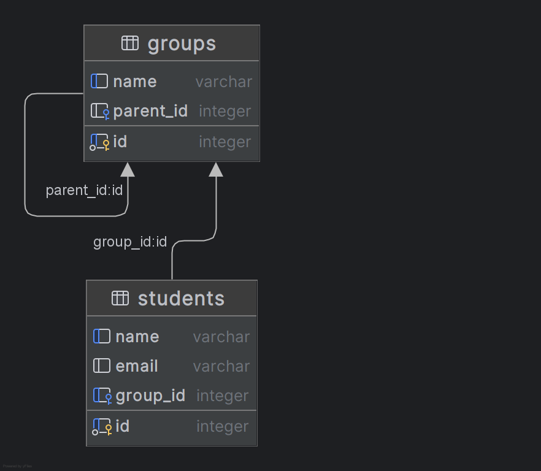

[Документация](http://127.0.0.1:8000/docs)



# Управление пользователями образовательного учреждения

Это RESTful API приложение для управления студентами и академическими группами образовательного учреждения. Проект разработан с использованием **FastAPI** для построения API, **SQLAlchemy** в связке с **SQLite** в качестве СУБД, и **Pydantic** для валидации входящих и исходящих данных.

## Описание проекта

Приложение предоставляет следующие основные возможности:
- **Управление студентами:** Создание, получение, обновление, удаление студентов, а также поиск студентов по имени или названию их группы.
- **Управление группами:** Создание, получение (как плоского списка, так и в виде иерархического дерева с вложенными подгруппами), обновление и удаление групп. При удалении группы предусмотрена защита – группа не может быть удалена, если у неё существуют подгруппы.
- **Валидация и обработка ошибок:** В процессе работы API проверяет корректность входных данных (например, существует ли указанная группа) и возвращает понятные сообщения об ошибках вместе с соответствующими HTTP статусами.

## Архитектура решения

### Технологии

- **FastAPI:** Обеспечивает высокую производительность, удобное описание эндпоинтов, автоматическую генерацию документации (Swagger UI / Redoc).
- **SQLAlchemy:** ORM для работы с реляционной базой данных SQLite. Используются декларативные модели для описания таблиц и связей.
- **SQLite:** Простая файловая база данных, подходящая для демонстрационных целей и разработки.
- **Pydantic:** Определяет схемы данных для валидации входящих HTTP-запросов и формирования корректных ответов.

### Структура базы данных

Проект реализует две основные таблицы:
- **groups**
  - `id` – уникальный идентификатор группы.
  - `name` – название группы.
  - `parent_id` – идентификатор родительской группы (опционально). Позволяет создавать иерархическую структуру (группы и подгруппы).
- **students**
  - `id` – уникальный идентификатор студента.
  - `name` – имя студента.
  - `email` – контактный адрес электронной почты.
  - `group_id` – внешний ключ, указывающий на группу, в которую зачислен студент.

Связи между таблицами реализуются через внешний ключ (students.group_id → groups.id) и самоссылку для групп (поле parent_id).

### Схема процесса обработки запроса

1. **Приём запроса:** Клиент обращается к соответствующему API эндпоинту (например, POST `/students` или GET `/groups`).
2. **Валидация данных:** FastAPI с помощью Pydantic проверяет корректность данных, переданных в запросе. При наличии ошибок возвращается соответствующий HTTP статус (например, 400).
3. **Работа с базой данных:**  
    - Создана зависимость `get_db`, которая обеспечивает открытие и закрытие сессии для работы с базой через SQLAlchemy.
    - При выполнении операций (создание, обновление, удаление) сессия осуществляет commit/rollback, а объекты обновляются и возвращаются обратно клиенту.
4. **Обработка бизнес-логики:**  
    - При создании студента происходит проверка существования группы с указанным ID.
    - При обновлении группы выполняется проверка, чтобы группа не стала родительской для самой себя, а также проверка на существование указанного родителя.
    - При удалении группы дополнительно проверяется наличие вложенных подгрупп. Если они есть – операция удаления блокируется.
5. **Формирование ответа:** Полученные или измененные данные преобразуются в объекты Pydantic и отправляются клиенту с необходимыми полями и корректным HTTP статусом.
6. **Документация API:** FastAPI автоматически генерирует документацию, доступную по адресам `/docs` (Swagger UI) и `/redoc`.

## Потоки данных

- **От клиента к серверу:**  
  Клиент отправляет HTTP-запрос с нужными параметрами (JSON-тело, параметры запроса или URL-путь) → FastAPI получает запрос и запускает соответствующую обработку.
  
- **Валидация и преобразование:**  
  FastAPI использует Pydantic для проверки и преобразования входных данных → при выявлении ошибок запрос обрывается с соответствующим сообщением.

- **Работа с БД:**  
  Полученные данные обрабатываются логикой бизнес-процессов → через dependency `get_db` инициируется сессия SQLAlchemy → выполняется SQL-запрос к SQLite для получения/обновления/удаления данных.

- **Формирование ответа:**  
  Результат преобразуется в Pydantic-модель и возвращается клиенту в формате JSON.

## Запуск приложения

1. **Установка зависимостей:**  
   ```bash
   pip install fastapi uvicorn sqlalchemy pydantic
    ```
   
2. **Запуск сервера:**
   ```bash
   uvicorn main:app --reload
    ```
   
3. **Документация:**
После запуска приложение доступно по адресу [http://127.0.0.1:8000/docs](http://127.0.0.1:8000/docs) для интерактивного тестирования API.

